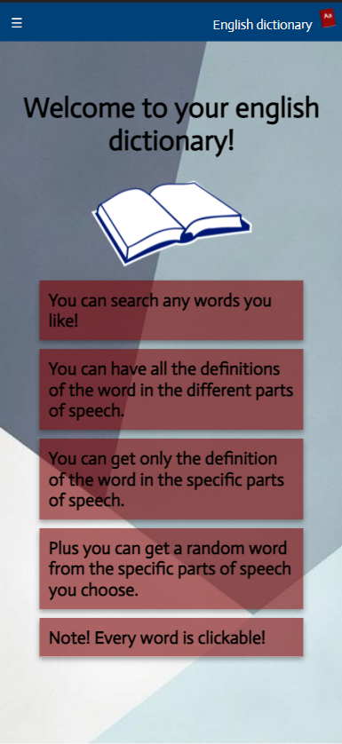
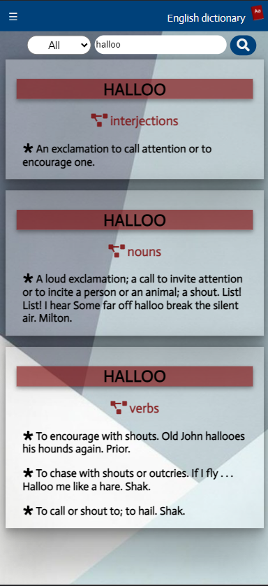

# English-Dictionary-AWS

### Build an English dictionary by practicing many AWS services such as: DynamoDB | Lambda | CloudFormation | API Gateway | S3 | Serverless Framework |

---

### Technologies in use - 👩‍💻👨‍💻

- **[React](https://reactjs.org/)**
- **[TypeScript](https://www.typescriptlang.org/)**
- **[React Router DOM](https://www.npmjs.com/package/react-router-dom)**
- **[Serverless framework](https://www.serverless.com/)- For writing and uploading the backend as AWS services.**

#### AWS Services -

- **Lambda & CloudFormation & Api-Gateway- In order to upload an express server 🔼☁**
- **DynamoDB- In order to store over 100,000 words ☁**
- **S3- In order to serve the front as static files ☁**

#### Packages 📦

- **Front-end : [Axios](https://www.npmjs.com/package/axios) - For API requests | [Notyf](https://www.npmjs.com/package/notyf) - for nice popUp messages |**

- **Back-end : [Express](https://www.npmjs.com/package/express) | [AWS-SDK](https://www.npmjs.com/package/aws-sdk)**

---

## My app -

---

### Features - 💫

- **Over 100,000 of words!**
- **Search by word and get all its definitions in the different parts of speech 🆎🔎**
- **Search by word and part of speech desired 🆎🔎**
- **Receiving a random word in a particular part of speech 🍥🔎**
- **Receive a random word in a particular part of speech that contains a letter or letter combination of your choice 🍥🔎**
- **By clicking on any of the words you can switch to the definition of the same word! 😱**
- **Mobile first design! 💅**
- **Cute word not found page 💅**
- **Awesome loader 💅**

### future 👩‍🚀

#### Front:

- **An indication that the words can be clicked**
- **My Footer**

#### Back:

- **errorHandler to server**
- **DB - Initialization by script and not by user**

---

## Local use -

### Github 🐱‍👤

- **Clone this repo**
- **Run `npm i` on the `client` and `backend` dirs - To install all the dependencies**

#### To seed the DB -

- **Download the AWS CLI and configure your details**
- **Create a table on dynamoDB and switch the `TableName`**
- **Create `.env` file and save - ACCESS_KEY_ID=?, SECRET_ACCESS_KEY=?**
- **Run `node /backend/utils/seed-db/index` to start seeding your table (This may take some time)**

#### To upload the backend as lambda

- **[Download serverless](https://www.serverless.com/framework/docs/getting-started)**
- **Run `serverless deploy` on `backend` dir.**

#### To run the app

- **Back- To run local run `sls offline start` (On PORT=3000)**
- **Front - Run `npm start` on `client` dir (On PORT=3006)**

---

## Screenshots 📸 -

### 

### 

---

## Assignment

Your about to build an english dictionary app

1. Download [English Dictionary in CSV format](https://www.bragitoff.com/2016/03/english-dictionary-in-csv-format/)
2. [x] Set up a DynamoDB with `dictionary` table
3. [x] **DATABASE:**
   1. [x] Parse & Insert all words, in a common structure, to `dictionary` table
4. [x] **BACKEND:**
   1. build a REST API with the following end point(s):
      1. [x] `GET /:word` - if word has more than one parts of speech will return all words part of speech, else, will return a word + definition + part of speech.
      2. [x] `GET /:word/:partOfSpeech` - will return a word + definition + part of speech [(noun, verb, adjectives, etc...)](https://www.dictionary.com/e/parts-of-speech/)
      3. [x] `GET /part-of-speech/:part` - for example, `/part-of-speech/adjective`, will return a random word + definition + part of speech (`part` is enum)
      4. [x] `GET /part-of-speech/:part?letter=X` - for example, `/part-of-speech/noun?letter=m`, will return a random word with the same letter + definition + part of speech
   2. [x] **BONUS**: should be deployed as `lambda function`
5. [x] **FRONTEND:**
   1. [x] build a `create-react-app` english dictionary app (mobile first)
   2. [x] URL routes:
      1. [x] `/:word` - dynamic route - `word` is dynamic URL parameter, used to request backend api
      1. [x] `/:word/:partOfSpeech` - dynamic route - `word` is dynamic URL parameter, used to request backend api
      1. [x] `/part-of-speech/:part` - `part` is enum URL parameter, used to request backend api
   3. [x] each word in dictionary is clickable and will redirect to a common URL
   4. [x] **BONUS** should be deployed to `S3 bucket`
